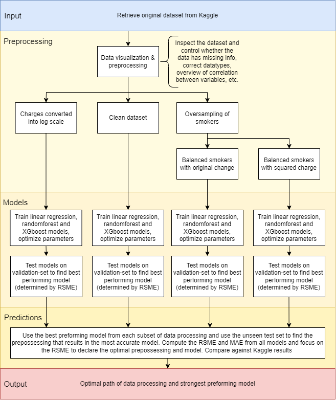

# Insurance Forecast Group 3

## Project Description
The goal of this task is to help medical insurers develop accurate pricing models by using historical data to predict medical costs for individual users. With access to such data, insurers can create better insurance products, plan for specific outcomes, or manage large portfolios.

Dataset Summary:

The dataset includes 1,339 medical insurance records.
The target variable is the individual medical costs billed by insurance companies (represented by the "charges" column).
Other columns contain personal information like age, gender, family status, and smoking habits, among other features.

Task: To accurately predict these medical costs based on the provided features.

Hint: You are expected first to conduct data preprocessing and visualization to get an overview of the dataset, then train models based on differnt machine learning algorithms to predict medical costs.

[Link to dataset file (insurance.csv):](https://www.kaggle.com/datasets/mirichoi0218/insurance?select=insurance.csv)

## Table of Contents
- Overview
- Installation
- Usage
- Features
- Conclution
- Information

## Overview

The reseach question we formed and set out to answer is how different preprocceing tecniques can improve predictions and what path lead to the most accurate result?

After viewing the dataset, our group concluded the most interesting and fruitful approach would be to apply different preprossesing techniques and models to view what would give the optimal outcome. The procedure for the project can be viewed in the flowchart below. It depicts how the dataset was preprossessed in different manners, which resulted in four different datasets. Then three different models were applied, where we used RSME as a deciding metric to choose inbetween models and to declare the best preprosses and model. 



## Installation
```code
# Clone the repository
git clone https://github.com/Ahsanfyfy/Project-Group-3.git

# Navigate into the project directory
cd PROJECT-GROUP-3

# Install dependencies
pip install -r requirements.txt

# Download dataset
python download_dataset.py
```
## Usage

Run the jupyter notebooks in the following order to have all required data.

1. preprocessing.ipynb
2. models.ipynb
3. predictions.ipynb

## Features

### preprocessing.ipynb:
 Uses the provided dataset and prints some statistics and plots to get an overview of the contents. Then it will correct parts like, for instance, data types to make them easier to work with. In this file, there are a few different routes being made. One is just a clean, usable version of the original dataset without modifications. Another route changes charges into log scale, and the last route balances out the smoker category. For the smokers, there are two different sub-routes: one keeps the charges in the original format, and one root squares the charges. This file provides 4 different datasets to train models and 1 common test set to use at the end.

 ### models.ipynb:
 In this file, we use the datasets produced by preprocessing to train three different models on each of the four datasets. The models selected for this project are Linear Regression, Random Forest, and XGBoost. When training each model, grid search is used to find optimal parameters. Within each dataset, the three models are tested on the validation set, then the RMSE is calculated to determine the best performance. This process is repeated for each dataset, and the file returns the 4 best models.

 ### predictions.ipynb:
 Loads the 4 best-performing models and gives them the unseen test data. Transforms the predictions from each model to the same scale, plots, and calculates RMSE. The results from this show which preprocessing procedure gave the most accurate model and which type of model responded best to this data.


## Conclution

 


### Future improvements
A recommendation to improve the project would be to include more models to see if there are models that react better to the datasets. In our case XGBoost preformed the best in 3/4 cases. Another suggestion could be to include more parametres in the grid seach for a more optimized outcome. 


## Information

Group 3 consist of:
- Mohammad Ahsan Raza
- Rémi Vialleton
- Noé Curé
- Oliver Langvik Veland
- John Olav Underdal